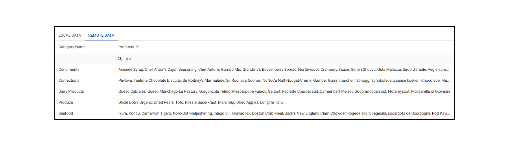

<!-- default badges list -->

[](https://supportcenter.devexpress.com/ticket/details/T1333768)
[](https://docs.devexpress.com/GeneralInformation/403183)
[](#does-this-example-address-your-development-requirementsobjectives)
<!-- default badges end -->
# DevExtreme DataGrid — Filter Data in Array-based Columns 

This example implements data filtering (remote and local) across DataGrid columns whose cells contain arrays of string values.



## Local Data Source

The DataGrid filters two collection columns against local data. Each cell in these columns displays data from the following sources:

1. An array of strings.
1. An array of objects. Each object contains a string field.

Both columns use **columns[]**.[calculateFilterExpression](https://js.devexpress.com/Documentation/ApiReference/UI_Components/dxDataGrid/Configuration/columns/#calculateFilterExpression) to implement custom filtering logic. The example defines a custom comparison function (`selector`) designed to filter values within each cell collection:

```js
function calculateFilterExpression(filterValue, selectedFilterOperation, target) {
    const column = this;
    if (filterValue) {
        const selector = (data) => {
            const applyOperation = (arg1, arg2, op) => {
                const normalizedArg1 = arg1.toLowerCase();
                const normalizedArg2 = arg2.toLowerCase();
                if (op === "=") return normalizedArg1 === normalizedArg2;
                // ...
            };

            const values = extractDisplayValues
                ? column.calculateDisplayValue(data).toLowerCase().split(", ")
                : column.calculateCellValue(data);
            return !!values?.find((v) => applyOperation(v, filterValue, selectedFilterOperation));
        };
        return [selector, "=", true];
    }
    return this.defaultCalculateFilterExpression.apply(this, arguments);
}
```

## Remote Data Source

For remote filtering, the DataGrid processes one column. The example sets [RemoteOperations](https://js.devexpress.com/Documentation/ApiReference/UI_Widgets/dxDataGrid/Configuration/remoteOperations/) to `true`, and the component displays data from an array of objects. Each of these objects contains a string field.

The example configures remote filtering in an ASP.NET Core server application ([ServerApp](/ServerApp/ServerApp/)). This server uses [DevExtreme.AspNet.Data](https://github.com/DevExpress/DevExtreme.AspNet.Data) and calls `RegisterBinaryExpressionCompiler` to extend filter expression capabilities. Refer to the following file for implementation details: [FilterByCollectionPropertyHelper.cs](ServerApp/ServerApp/FilterByCollectionPropertyHelper.cs).

### Remote Data Source Types

**ServerApp** includes two data controllers:

1. `InMemoryDataController` (default): Supplies data from in-memory variables defined in the ASP.NET Core server application. Use this controller for testing.
2. `DbDataController`: Supplies data from a Microsoft SQL (MSSQL) Northwind database. Better suited for production environments.

## Files to Review

- **Server App**
    - [FilterByCollectionPropertyHelper.cs](ServerApp/ServerApp/FilterByCollectionPropertyHelper.cs)
    - [InMemoryDataController.cs](ServerApp/ServerApp/Controllers/InMemoryDataController.cs)
    - [DbDataController.cs](ServerApp/ServerApp/Controllers/DbDataController.cs)
- **Angular**
    - [data-grid-local.component.html](Angular/src/app/components/data-grid-local/data-grid-local.component.html)
    - [data-grid-remote.component.html](Angular/src/app/components/data-grid-remote/data-grid-remote.component.html)
- **React**
    - [data-grid-local.tsx](React/src/components/data-grid-local.tsx)
    - [data-grid-remote.tsx](React/src/components/data-grid-remote.tsx)
- **Vue**
    - [DataGridLocal.vue](Vue/src/components/DataGridLocal.vue)
    - [DataGridRemote.vue](Vue/src/components/DataGridRemote.vue)
- **jQuery**
    - [DataGridLocal.js](jQuery/src/DataGridLocal.js)
    - [DataGridRemote.js](jQuery/src/DataGridRemote.js)
- **ASP.NET Core**    
    - [DataGridLocal.cshtml](ASP.NET%20Core/Views/Home/_DataGridLocal.cshtml)
    - [dataGridLocal.js](ASP.NET%20Core/wwwroot/js/dataGridLocal.js)
    - [DataGridRemote.cshtml](ASP.NET%20Core/Views/Home/_DataGridRemote.cshtml)
    - [dataGridRemote.js](ASP.NET%20Core/wwwroot/js/dataGridRemote.js)
    - [FilterByCollectionPropertyHelper.cs](ASP.NET%20Core/FilterByCollectionPropertyHelper.cs)
    - [InMemoryDataController.cs](ASP.NET%20Core/Controllers/InMemoryDataController.cs)
    - [DbDataController.cs](ASP.NET%20Core/Controllers/DbDataController.cs)

## Documentation

- [Filtering Columns Bound to Collection](https://js.devexpress.com/Documentation/Guide/UI_Components/DataGrid/Filtering_and_Searching/#API/Filtering_Columns_Bound_to_Collection)

<!-- feedback -->
## Does This Example Address Your Development Requirements/Objectives?

[](https://www.devexpress.com/support/examples/survey.xml?utm_source=github&utm_campaign=devextreme-datagrid-filter-array-column&~~~was_helpful=yes) [](https://www.devexpress.com/support/examples/survey.xml?utm_source=github&utm_campaign=devextreme-datagrid-filter-array-column&~~~was_helpful=no)

(you will be redirected to DevExpress.com to submit your response)
<!-- feedback end -->
